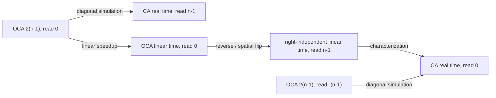

# A Guide to the Cellular Automata Formalization

This document is a mathematical and architectural guide to the repository. It
is intended for readers who know cellular automata or Lean, but not necessarily
both. The concise public theorem index is
[`results.lean`](../CellularAutomatas/results.lean); implementation lemmas live
under [`proofs/`](../CellularAutomatas/proofs/).

## 1. What Is Formalized?

The project studies one-dimensional, radius-one cellular automata (CAs) over
finite alphabets. It treats a CA both as:

- a **transducer**, producing an output at every cell and time; and
- a **language recognizer**, producing a Boolean at a prescribed time and
  position.

The main themes are:

1. simulations between unrestricted and one-way CAs;
2. border normalization and constant-factor speedup;
3. real-time, linear-time, and reversal equivalences;
4. composition of real-time CA transductions; and
5. structural properties of length-preserving advice.

The declarations exported from `results.lean` are complete and checked by the
repository's axiom verifier. Open questions and unfinished experiments are kept
in explicitly named files rather than mixed into the stable result module.

## 2. Core Model

### 2.1 Finite alphabets and cellular automata

An `Alphabet α` packages finite enumerability, decidable equality, and a default
element. A cellular automaton separates its input, internal state, and output:

```lean
structure CellAutomaton (α β : Type) where
  Q : Type
  δ : Q → Q → Q → Q
  embed : α → Q
  project : Q → β
```

The state type `Q` is itself a finite alphabet. A configuration is a function
`ℤ → Q`. One parallel transition is

$$
  \Delta_C(c)(p) = \delta(c(p-1), c(p), c(p+1)).
$$

`C.nextt c t` iterates this transition for `t` steps. The projected computation
at time `t` and position `p` is `C.comp c t p`.

Separating `embed` and `project` is useful: recognizers use Boolean output,
while composition theorems use arbitrary finite output alphabets.

### 2.2 Finite words on an infinite configuration

A word $w$ of length $n$ occupies positions $0,\ldots,n-1$. Outside that
interval, `word_to_config` returns `none`, the border symbol:

$$
  \langle w \rangle(p) =
  \begin{cases}
    \operatorname{some}(w_p) & 0 \le p < n,\\
    \operatorname{none} & \text{otherwise.}
  \end{cases}
$$

The basic recognizer type is therefore
`LCellAutomaton α = CellAutomaton (Option α) Bool`.

No quiescence or deadness condition is built into the border. Instead, the
library proves constructions that impose quiescent or absorbing borders while
preserving the relevant computation. This keeps the core model general and
moves geometric assumptions into explicit theorems.

### 2.3 Trace and real-time trace

`C.trace c t` observes position `0` after `t` steps. For a word, the real-time
trace collects the first `n` temporal outputs:

$$
  \operatorname{trace\_rt}_C(w)_i =
  \operatorname{comp}_C(\langle w\rangle,i,0), \qquad 0 \le i < |w|.
$$

Thus `trace_rt` is a length-preserving word function. It is causal: its prefix
of length `i` depends only on the input prefix of length `i`. This temporal
transducer view is central to the advice theory.

### 2.4 Acceptance schemas

An `AcceptanceSchema` contains a time function `t : ℕ → ℕ` and an observation
position `p : ℕ → ℤ`. A `tCellAutomaton schema α` accepts `w` when the projected
state at `schema.t |w|` and `schema.p |w|` is true.

The coordinate names are literal:

| Schema | Time | Position |
|---|---:|---:|
| `rt_left` | $n-1$ | $0$ |
| `rt_right` | $n-1$ | $n-1$ |
| `time_2n_left` | $2(n-1)$ | $0$ |
| `time_2n_right` | $2(n-1)$ | $n-1$ |
| `time_2n_left_neg_np1` | $2(n-1)$ | $-(n-1)$ |
| `lt_left c` | $c(n-1)$ | $0$ |
| `lt_right c` | $c(n-1)$ | $n-1$ |

Consequently:

- `CA_rt`, `CA_2n`, and `CA_lt` observe the left end at position `0`;
- `CAr_rt` observes the right end at position `n - 1`;
- `OCA_*` adds left-independence: the local rule ignores its left neighbor;
- `OCAr_*` adds right-independence and uses right-reading schemas.

The notation `ℒ T` is the set of languages recognized by automata of type `T`.
`Language.rev` reverses every word in a language, and `ℒ_rev T` reverses every
language in `ℒ T`.

## 3. Construction Toolkit

### 3.1 Locality and coordinate algebra

The basic library proves that the state at `(t,p)` depends only on the radius
`t` light cone, that computations commute with spatial shifts, and that time
iterations compose. Most larger constructions reduce to these lemmas plus
integer arithmetic discharged by `omega` or `ring`.

### 3.2 Unrestricted and one-way simulation

A left-independent CA can be converted to an unrestricted CA that simulates two
original steps per new step:

$$
  \operatorname{comp}_{C'}(c,t,i)
  = \operatorname{comp}_C(c,2t,i-t).
$$

Conversely, an unrestricted CA can be encoded by a left-independent CA whose
even-time states represent

$$
  \operatorname{comp}_{C'}(c,2t,i)
  = \operatorname{single}(\operatorname{comp}_C(c,t,i+t)).
$$

These are exported as `result_left_indep_to_regular` and
`result_regular_to_left_indep`. They are the geometric bridge behind several
OCA/CA equivalences.

### 3.3 Border normalization

`QuiescentBorderLeftIndep` gives a left-independent automaton a quiescent border
while preserving its computation inside the one-way light cone. `DeadBorder`
uses a zigzag lane folding to produce a completely absorbing border while
preserving the trace for a prescribed linear-time window.

The latter construction is important for iterated speedups: a passive boundary
prevents information introduced by one transformation from contaminating the
next.

### 3.4 Speedup

There are two distinct speedup mechanisms:

- **Additive speedup** removes a fixed number of initial steps from a temporal
  trace. It supports real-time transducer composition.
- **Linear-time compression** packs several spatially adjacent states into a
  tuple and simulates multiple original steps at once.

The language-level consequences include:

$$
  \mathcal L(CA_{2n}) = \mathcal L(CA_{lt})
$$

and

$$
  \mathcal L(OCA_{2n}) = \mathcal L(OCA_{lt}).
$$

The OCA proof uses tuple width `c - 1` and reads component `c - 2`, which gives
exactly $c(n-1)$ original steps at time $2(n-1)$.

## 4. Language-Class Results

### 4.1 Regular languages and strict separation

Every DFA language is recognized by a real-time OCA:

$$
  \mathcal L(DFA) \subseteq \mathcal L(OCA_{rt}).
$$

Over a unary alphabet, every real-time OCA language is regular. On the other
hand, an unrestricted real-time CA recognizes the language of words whose
length is a power of two. Lifting this witness to any inhabited finite alphabet
gives the strict inclusion

$$
  \mathcal L(OCA_{rt}) \subsetneq \mathcal L(CA_{rt}).
$$

The power-of-two recognizer uses a bouncing signal whose return times are
$2^k-1$.

### 4.2 The OCA/CA diagonal

The factor-two simulations become exact language equivalences when paired with
appropriate observation positions:

$$
  \mathcal L(OCA_{2n}) = \mathcal L(CAr_{rt}),
$$

$$
  \mathcal L(OCA_{2n}^{\,-(n-1)}) = \mathcal L(CA_{rt}).
$$

The second class is `OCA_2n_left_neg_np1`: it runs for $2(n-1)$ steps and is
observed at $-(n-1)$.

Flipping space exchanges left-reading and right-reading while reversing the
input. Together with OCA linear-time speedup, this gives:

$$
  \mathcal L^{R}(OCA_{lt}) = \mathcal L(OCAr_{lt})
  = \mathcal L(CA_{rt}).
$$

The combined statement is exported as `ca_rt_eq_rev_oca`.



### 4.3 Real time, linear time, and reversal

The central global equivalence is

$$
\begin{aligned}
  &\forall \beta,\quad
    \mathcal L(CA_{rt}(\beta)) = \mathcal L(CA_{lt}(\beta))\\
  \Longleftrightarrow\;&
  \forall \gamma,\quad
    \mathcal L(CA_{rt}(\gamma)) =
    \mathcal L^{R}(CA_{rt}(\gamma)).
\end{aligned}
$$

This is `result_rt_eq_lt_iff_rt_eq_rt_rev`.

The forward direction is short after normalization to `CA_2n`: reversals of
real-time languages can be recognized in time $2(n-1)$, and the assumed class
equality brings them back to real time.

The reverse direction is more delicate. It pads words over `Option β`, applies
reversal closure twice, and removes the padding with `lx_rt_implies_rt`. This is
why the hypothesis quantifies over **all alphabets**: pointwise reversal closure
only for `β` does not provide the required closure for `Option β`.

## 5. Real-Time Transducers

The theorem `result_rt_transducers_closed_under_composition` constructs a CA
whose real-time trace is the composition of two real-time traces:

$$
  \operatorname{trace\_rt}_C
  = \operatorname{trace\_rt}_{C_2}
    \circ \operatorname{trace\_rt}_{C_1}.
$$

This is not ordinary sequential execution: the second CA would normally need
the entire output word of the first before it could start. The construction
rearranges the first trace onto diagonals, simulates the second CA from those
diagonal events, restores the output stream, and removes a constant delay:

```text
AddBorder
  -> CompressToDiag
  -> SimFromLambda
  -> DecompressTriple
  -> SpeedupKSteps
```

The proof is split into small construction modules under
`proofs/advice_theory/compose_trace_rt/` and
`proofs/constructions/`. Each module states a local space-time invariant; the
final composition theorem mostly assembles those invariants.

## 6. Advice Theory

### 6.1 Advice and closure

An `Advice α Γ` is a length-preserving map from input words to annotation words.
A recognizer using advice sees `w` zipped with `adv w`.

Two closure notions are deliberately distinguished:

- `adv.weak_rt_closed` maps each real-time recognizer using `adv` to an
  equivalent unadvised recognizer over the same base alphabet.
- `adv.rt_closed` requires this eliminability uniformly under finite alphabet
  refinements and relabelings.

More precisely, for every finite alphabet `β` and map `π : β → α`, the lifted
advice is

$$
  (\operatorname{adv.lift}\;\pi)(w)
  = \operatorname{adv}(w.\operatorname{map}(\pi)).
$$

Uniform closure requires this lifted advice to be weakly RT-closed over `β`.
For example, `β = α × S` may add a finite track of construction-specific state
and `π` may forget that track. Weak closure over `α` alone does not by itself
cover such decorated inputs; uniform closure guarantees that advice elimination
survives the refinement. This is why `rt_closed`, rather than only
`weak_rt_closed`, is the natural interface for composing constructions.

Closure means that advice can be **eliminated from recognition**. It is not the
same as `IsRtAdvice`, which says that the whole advice word can be **computed as
a spatial slice** of a CA at time $n-1$.

### 6.2 Temporal and two-stage advice

A `CArtTransducer` computes a causal advice by the temporal trace at cell `0`.
A `TwoStageAdvice` consists of:

1. a real-time CA transducer; and
2. a finite-state transducer scanning its output right-to-left.

Thus

$$
  f = M.\operatorname{scanr} \circ \operatorname{trace\_rt}_C.
$$

The stable results prove:

- two-stage advice is uniformly RT-closed;
- two-stage advice is closed under composition;
- uniformly RT-closed advice is closed under composition;
- prefix-membership advice for an RT language is two-stage;
- causal weakly RT-closed advice is computed by a single real-time CA trace;
- middle-marker advice is not two-stage; and
- exponential-middle advice is two-stage.

The composition proof uses a backwards-FSM construction: the second CA stores a
simulation for every possible state of the first finite-state transducer, and
the final FST selects the simulation corresponding to the actual state.

### 6.3 Compression advice and the RT/LT question

`Advice.compress2` annotates each position with a pair of consecutive input
symbols (or border markers after the packed input ends). The project proves:

$$
  \mathcal L(CA_{rt}) = \mathcal L(CA_{lt})
  \quad\Longleftrightarrow\quad
  \operatorname{compress2}\text{ is weakly RT-closed}.
$$

This turns the real-time versus linear-time question into an advice-elimination
question. Over a unary alphabet, middle-marker advice and `compress2` have
equivalent weak closure behavior, yielding the corresponding unary
characterization.

## 7. Why the Formalization Is Difficult

The mathematical model is local, but the important proof obligations are
global. Defining one transition is easy; proving that a sequence of transformed
automata represents the intended original cell at the intended time is where
most of the work lies.

### 7.1 Turning diagrams into invariants

Informal CA proofs rely heavily on space-time diagrams. A signal is shifted,
two lanes are folded together, or a block of cells is packed into one larger
state. In Lean, each step needs:

1. a finite state type and local transition rule;
2. an embedding of the previous configuration;
3. a decoder for the represented state; and
4. an invariant quantified over every relevant time and position.

The coordinates use several number systems at once: time and word lengths are
natural numbers, positions are integers, and components of packed cells use
finite index types. Consequently, an identity suggested by a picture becomes
an exact statement involving casts, shifts, inequalities, and conventions such
as $n-1$. A one-cell or one-step mismatch at one interface invalidates every
later stage.

Automation can usually discharge the local arithmetic once the correct
invariant has been stated. It does not choose the representation or discover
the coordinate invariant that makes two independently useful constructions
compose.

### 7.2 Borders and finite exceptions

The border symbol is not assumed to be quiescent. This makes the core model
general, but every construction that relies on an empty exterior must first
manufacture and verify the required boundary behavior. The dead-border and
quiescent-border constructions prove that unwanted signals cannot enter the
light cone used by the simulation.

Small inputs are another genuine proof obligation. Expressions such as $n-1$
behave differently at $n=0$, compressed blocks may not exist yet, and a signal
construction may need a minimum amount of room. The padding-elimination
pipeline, for example, is proved directly for $n \geq 9$; the finitely many
shorter words are repaired using closure under finite symmetric difference.
This is the formal replacement for the common paper phrase “ignoring finitely
many small cases.”

### 7.3 The hard RT/LT-reversal direction

The key equivalence reconstructs
[a result of Ibarra and Jiang (1988)](https://doi.org/10.1016/0304-3975(88)90040-0),
combined with the linear speedup theorem to replace $2(n-1)$ time by linear
time. The hard implication assumes real-time closure under reversal and must
turn a $2(n-1)$-time recognizer into a real-time one.

The proof first moves to `Option α`, using `none` as a fresh padding symbol.
Enough padding makes the original computation fit within real time on the
longer word. Reversal closure moves the padding from one end to the other, but
then the padding must be simulated and removed when only the original word is
available.

The lemma `lx_rt_implies_rt` performs that removal through a multi-stage
space-time pipeline. It converts between unrestricted and one-way automata,
broadcasts and repositions a diagonal value, compresses by a factor aligned
with `nextPow2`, folds the negative half-line onto the input half-line, and
normalizes the border. After these geometric transformations, the remaining
marker describing the implicit prefix is expressed as two-stage advice and
eliminated by the general RT-closure theorem.

Each stage has a useful local specification. The difficulty is making the
output equation of one stage syntactically and arithmetically match the input
equation of the next across the entire pipeline.

### 7.4 Abstractions that remove proof debt

The advice theory is valuable because it turns the final marker-removal trick
from a theorem-specific construction into a reusable interface. Once an advice
is exhibited as a real-time trace followed by a right-to-left finite-state
scan, uniform RT-closure eliminates it from any compatible recognizer.

The same principle drives real-time transducer composition. The second machine
cannot wait for the first machine to finish. The proof therefore changes the
geometry of the first trace, simulates from staggered events, and removes the
resulting delay. For composition of two-stage advice, a backwards-FST
construction additionally carries simulations for every possible finite-state
summary and lets the final scan select the correct one.

The main value of the repository is this collection of reusable verified
interfaces: locality, shifts, border control, speedup, folding, temporal
traces, finite-state scans, and advice elimination. The final language-class
equalities are concise because the difficult geometry has been isolated behind
those interfaces, not because the underlying constructions are simple.

## 8. Reading the Lean Development

A useful reading order is:

1. [`defs.lean`](../CellularAutomatas/defs.lean): model, schemas, language
   classes, advice, and reversal.
2. [`basic.lean`](../CellularAutomatas/proofs/basic.lean): locality, shifts,
   time composition, and trace lemmas.
3. [`left_indep_to_regular.lean`](../CellularAutomatas/proofs/constructions/left_indep_to_regular.lean)
   and [`left_indep_from_regular.lean`](../CellularAutomatas/proofs/constructions/left_indep_from_regular.lean):
   the fundamental diagonal simulations.
4. [`linear_time_speedup.lean`](../CellularAutomatas/proofs/constructions/linear_time_speedup.lean)
   and [`speedup_right_border_oca.lean`](../CellularAutomatas/proofs/constructions/speedup_right_border_oca.lean):
   the two linear speedup theorems.
5. [`oca_reversal_equivalences.lean`](../CellularAutomatas/proofs/language/oca_reversal_equivalences.lean):
   the OCA/CA reversal diagram.
6. [`rt_eq_2n_iff_rt_eq_rt_rev.lean`](../CellularAutomatas/proofs/rt_eq_2n_iff_rt_eq_rt_rev/rt_eq_2n_iff_rt_eq_rt_rev.lean):
   the global RT/LT equivalence.
7. [`results.lean`](../CellularAutomatas/results.lean): the curated endpoint.

For advice theory, start with the definitions in `defs.lean`, then read
`rt_closed/of_two_stage.lean`, `compose_trace_rt/compose_cart.lean`, and
`rt_eq_lt_iff_compress2_weak_rt_closed.lean`.

## 9. Build, Trust, and Open Work

Build the stable result module and run the configured axiom policy with:

```bash
lake build ./CellularAutomatas/results.lean
lake build verify_proofs
```

The verifier permits only `Quot.sound`, `Classical.choice`, and `propext` for
its configured modules. It checks dependencies, so a hidden `sorryAx` in the
stable result graph would fail verification.

The repository also contains explicit research workspaces:

- `open_questions.lean` states unresolved conjectures;
- `verification_candidates.lean` contains candidates awaiting promotion;
- `proofs/wip/` contains unfinished constructions; and
- `proofs/advice_theory/rt_lt_advice.lean` contains unfinished spatial-advice
  implications.

These files are useful for ongoing work but are not part of the stable theorem
surface documented above.
