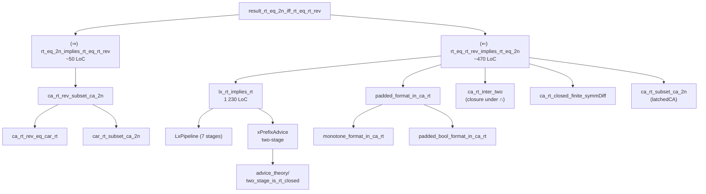
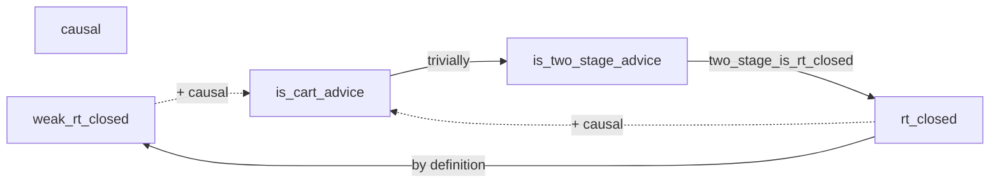
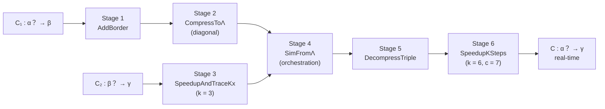
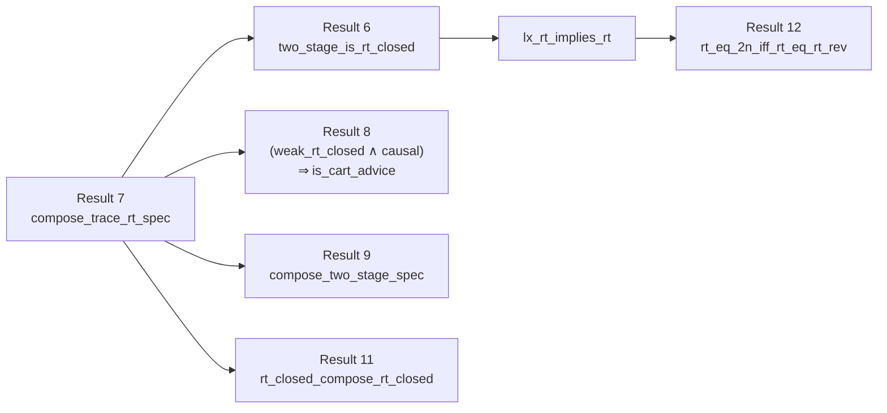
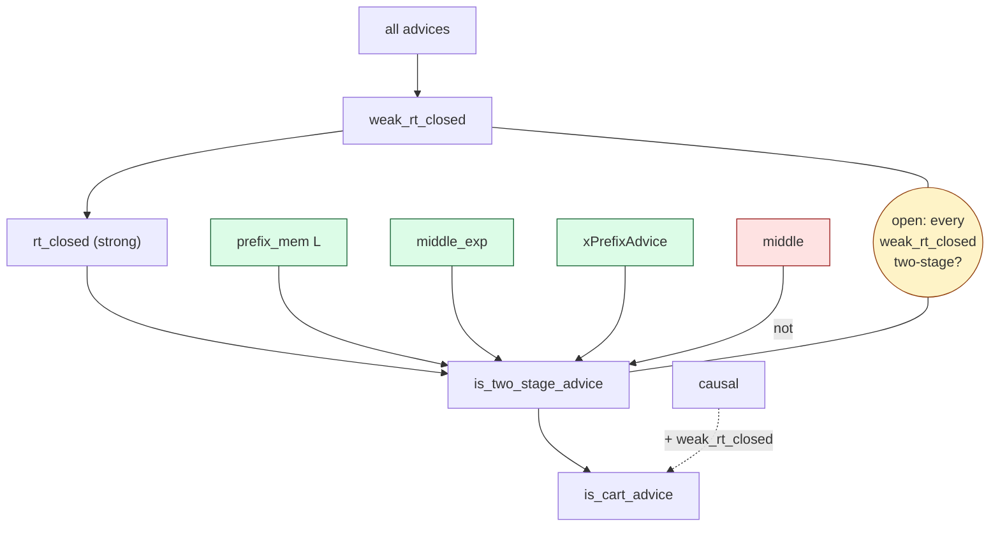

# Report: Analysis of `result_rt_eq_2n_iff_rt_eq_rt_rev` and the Project as a Whole

> *Mechanized analysis of the Lean 4 / Mathlib4 project [`lean-cellular-automata`](.), with focus on the central reproduction theorem (Ibarra & Jiang 1988) and an assessment of the project's overall significance.*

---

## Table of Contents

1. [Executive Summary](#1-executive-summary)
2. [Project Overview](#2-project-overview)
3. [Foundational Definitions](#3-foundational-definitions)
4. [The Theorem Statement](#4-the-theorem-statement)
5. [The Proof Architecture](#5-the-proof-architecture)
 6. [The Easy Direction (⇒)](#6-the-easy-direction-)
7. [The Hard Direction (⇐)](#7-the-hard-direction-)
8. [The Key Lemma `lx_rt_implies_rt`](#8-the-key-lemma-lx_rt_implies_rt)
9. [Advice Theory: The Conceptual Engine](#9-advice-theory-the-conceptual-engine)
10. [Dependency Graph](#10-dependency-graph)
11. [The Composition of RT Transducers (Result 7)](#11-the-composition-of-rt-transducers-result-7)
12. [Advice Theory In Depth](#12-advice-theory-in-depth)
13. [Quantitative Breakdown](#13-quantitative-breakdown)
14. [Significance and Difficulty](#14-significance-and-difficulty)
15. [Conclusion](#15-conclusion)

---

## 1. Executive Summary

The project mechanizes one-dimensional cellular automata theory in Lean 4 + Mathlib4. Its centerpiece reproduction is the equivalence (due to **Ibarra & Jiang, 1988**)

$$
\bigl(\forall \beta:\; \mathcal{L}(\mathrm{CA}_{rt}\,\beta) = \mathcal{L}(\mathrm{CA}_{2n}\,\beta)\bigr)
\;\iff\;
\bigl(\forall \gamma:\; \mathcal{L}(\mathrm{CA}_{rt}\,\gamma) = \mathcal{L}^{R}(\mathrm{CA}_{rt}\,\gamma)\bigr)
$$

between two long-standing open problems about real-time cellular automata: equality with 2n-time, and closure under language reversal.

The proof spans **~2 800 lines of Lean** built on top of **~21 000 lines** of supporting CA theory. The hard direction (⇐) uses a 7-stage CA simulation pipeline plus a custom **two-stage advice** framework that elegantly factors out the "x-prefix elimination" needed by the original paper. The easy direction (⇒) is short and reduces to two standing facts (`ca_rt_rev_eq_car_rt`, `car_rt_subset_ca_2n`).

The project is **substantial and significant** despite heavy LLM assistance: it contains a novel formalization of *advice for cellular automata*, fully mechanized end-to-end, with all main results closed under only the three Lean axioms `Quot.sound`, `Classical.choice`, `propext`. The mechanization difficulty is high — much of the work is about *engineering* CA constructions (signals, borders, compressions, foldings) inside dependent type theory, which requires a level of bookkeeping no current LLM can sustain unaided.

---

## 2. Project Overview

### 2.1 Scale

| Metric | Value |
|---|---|
| Lean source files (`CellularAutomatas/`) | 73 |
| Lines of Lean code | ~21 000 |
| Theorems / lemmas | ~470 |
| Main results in [results.lean](CellularAutomatas/results.lean) | 12 (all `sorry`-free) |
| Axioms transitively used by the main results | `Quot.sound`, `Classical.choice`, `propext` |
| Lean / Mathlib version | `leanprover/lean4:v4.26.0-rc2` / Mathlib4 v4.26.0-rc2 |
| Build jobs (incl. Mathlib) | ~3 081 |

### 2.2 Layout

```
CellularAutomatas/
├── defs.lean                   core types: CellAutomaton, Config, Trace, AcceptanceSchema, Advice, FST, ...
├── internal_defs.lean          BetaUnionSq, triple_at, ...
├── results.lean                12 main verified theorems
├── verification_candidates.lean
├── open_questions.lean
├── proofs/
│   ├── basic.lean              causality of trace_rt, locality, temporality
│   ├── border.lean             dead / quiescent border behaviour
│   ├── word_ops.lean           zip / split / fst / snd
│   ├── int_lemmas.lean         ℤ‐arithmetic
│   ├── ca_rt_finite_closure.lean       finite languages ⊆ ℒ(CA_rt)
│   ├── finite_state_transducers.lean   FST library: scanr, product, composition
│   ├── advice_theory/                  6 files; ~3 800 LoC
│   ├── constructions/                  ~22 files; ~2 500 LoC
│   ├── language/                       lift_language, dfa→OCA_rt, reversal
│   ├── time_constructible/             latched CA, c·n constructible
│   └── rt_eq_2n_iff_rt_eq_rt_rev/      8 files; ~2 800 LoC – the result analysed here
└── scripts/                    verify_proofs.lean (axiom checker), dependencies.lean
```

### 2.3 Build

```bash
lake build                          # full project
lake build CellularAutomatas.results
```

The repository assumes the project builds; this report does not re-run the build.

---

## 3. Foundational Definitions

These sit in [CellularAutomatas/defs.lean](CellularAutomatas/defs.lean) and are essential to even read the theorem statement.

### 3.1 The CA structure

```lean
class Alphabet (α : Type) where
  [dec : DecidableEq α] [fin : Fintype α] [inh : Inhabited α]

structure CellAutomaton (α β : Type) where
  Q : Type
  [alphabetQ : Alphabet Q]
  δ : Q → Q → Q → Q          -- local rule
  embed   : α → Q
  project : Q → β

abbrev LCellAutomaton (α : Type) := CellAutomaton α？ Bool   -- α？ := Option α
```

Splitting input/output (with `embed`/`project`) makes a CA a **transducer**, which is essential for composition results. The border alphabet is folded into `Option`: `none = #` (border), `some a = a` (input symbol).

### 3.2 Configuration, evolution, trace

```lean
def Config (α : Type) := ℤ → α
def next   (C : CellAutomaton α β) (c : Config C.Q) : Config C.Q :=
  fun p => C.δ (c (p-1)) (c p) (c (p+1))
def nextt  C c t := Nat.iterate (C.next) t c
def comp   C c t i := C.project (C.nextt c t i)
def trace  C c    : Trace β := fun t => C.comp ⦋c⦌ t 0
def trace_rt (C : CellAutomaton α？ β) (w : Word α) : Word β :=
  (List.range w.length).map (C.trace ⟬w⟭)
```

`trace_rt` is provably **causal** ([basic.lean](CellularAutomatas/proofs/basic.lean)) — a key fact that makes transducer composition work.

### 3.3 Acceptance schemas and language classes

A schema parametrises *when* and *where* the answer is read.

```lean
structure AcceptanceSchema where t : ℕ → ℕ; p : ℕ → ℤ
def AcceptanceSchema.rt_left      : AcceptanceSchema := ⟨(· - 1), fun _ => 0⟩
def AcceptanceSchema.time_2n_left : AcceptanceSchema := ⟨fun n => 2*(n-1), fun _ => 0⟩
def AcceptanceSchema.rt_right     : AcceptanceSchema := ⟨(· - 1), fun n => n - 1⟩

structure tCellAutomaton (α : Type) extends LCellAutomaton α where t : ℕ → ℕ; p : ℕ → ℤ
def tCellAutomaton.accepts (C) (w) := C.comp ⟬w⟭ (C.t w.length) (C.p w.length) = true
def tCellAutomaton.L       (C)     : Language α := { w | C.accepts w }
```

| Class | Schema | Notes |
|-------|--------|-------|
| `CA_rt α`    | `t = n−1`, `p = 0`     | real-time, left-reading |
| `CA_2n α`    | `t = 2(n−1)`, `p = 0`  | 2n-time |
| `CAr_rt α`   | `t = n−1`, `p = n−1`   | right-reading real-time |
| `OCA_rt α`   | `CA_rt` + left-independent | one-way real-time |

`ℒ : Set T → Set (Language α)` collects the languages defined by a set of CAs; `ℒ_rev S := { L^R | L ∈ ℒ S }`.

### 3.4 Notation conventions

- `α？` ≡ `Option α`
- `⟬w⟭` ≡ `word_to_config w` (input embedding with borders)
- `⦋c⦌` ≡ `embed_config c` (lifts an `α`-config to a `Q`-config)
- `C₁ ⨂ C₂` ≡ product CA, paired output

---

## 4. The Theorem Statement

[`CellularAutomatas/results.lean#L268-279`](CellularAutomatas/results.lean#L268-L279):

```lean
theorem result_rt_eq_2n_iff_rt_eq_rt_rev :
    (∀ (β : Type) [Alphabet β], ℒ (CA_rt β) = ℒ (CA_2n β)) ↔
    (∀ (γ : Type) [Alphabet γ], ℒ (CA_rt γ) = ℒ_rev (CA_rt γ)) :=
  rt_eq_2n_iff_rt_eq_rt_rev
```

In words:

> **(A)** RT and 2n-time CAs recognise the same languages over every alphabet.
> **(B)** The class of RT languages is closed under reversal over every alphabet.
>
> **(A) ⇔ (B).**

Both sides are *open problems* over a single fixed alphabet. The mechanised statement quantifies over **all** alphabets — this is necessary because the (⇐) direction internally lifts an alphabet `α` to `Option α` for padding.

This is **Result 12** in the project, and the only one in *Part III: Reproductions of Prior Results* — the statement is due to Ibarra & Jiang (1988).

---

## 5. The Proof Architecture

The proof file lives at [`CellularAutomatas/proofs/rt_eq_2n_iff_rt_eq_rt_rev/rt_eq_2n_iff_rt_eq_rt_rev.lean`](CellularAutomatas/proofs/rt_eq_2n_iff_rt_eq_rt_rev/rt_eq_2n_iff_rt_eq_rt_rev.lean) (839 LoC).



### Standing facts (used by both directions)

| Lemma | File | Statement |
|-------|------|-----------|
| `ca_rt_subset_ca_2n` | this file | ℒ(CA_rt) ⊆ ℒ(CA_2n) — pad time with `latchedCA_k` |
| `ca_rt_rev_eq_car_rt` | [`language/ca_rt_rev_eq_car_rt.lean`](CellularAutomatas/proofs/language/ca_rt_rev_eq_car_rt.lean) | ℒᴿ(CA_rt) = ℒ(CAr_rt) — flip δ, swap reading position |
| `car_rt_subset_ca_2n` | [`language/car_rt_subset_ca_2n.lean`](CellularAutomatas/proofs/language/car_rt_subset_ca_2n.lean) | ℒ(CAr_rt) ⊆ ℒ(CA_2n) — shift answer left in n−1 extra steps |
| `ca_2n_eq_ca_2n_proper` | this file | ℒ(CA_2n) = ℒ(CA_2n_proper) — switch between `t=2(n−1)` and `t=2n` via `composeKSteps` and `SpBDk` |

The "proper" / not-proper alignment (`2(n−1)` vs `2n`) is bureaucratic but necessary: the (⇐) construction naturally produces `2n` time.

---

## 6. The Easy Direction (⇒)

> Assume ℒ(CA_rt) = ℒ(CA_2n). Show ℒ(CA_rt) = ℒᴿ(CA_rt).

```
L ∈ ℒ(CA_rt)
⇒ L^R ∈ ℒᴿ(CA_rt)                    -- definition of ℒᴿ
   = ℒ(CAr_rt)                       -- ca_rt_rev_eq_car_rt
   ⊆ ℒ(CA_2n)                        -- car_rt_subset_ca_2n
   = ℒ(CA_rt)                        -- hypothesis
⇒ L^R ∈ ℒ(CA_rt) for every L ∈ ℒ(CA_rt)
⇒ ℒᴿ(CA_rt) = ℒ(CA_rt)
```

The Lean proof is roughly 50 lines of straightforward set-extensionality reasoning with `Language.rev_rev` to close the loop. The real intellectual content sits in the two standing facts above (each ~80–200 LoC of CA construction).

### `ca_rt_rev_eq_car_rt` (≈ 130 LoC)

Given `C : CA_rt α`, define the *flipped* CA `C.flip` whose local rule swaps left/right neighbours: `C.flip.δ a b c = C.δ c b a`. Then `(C.flip).comp on the reversed config = C.comp on the original config, mirrored about the centre`. Reading position `n−1` (CAr_rt) on the flipped config thus accepts `w^R` iff `C` accepts `w`. The non-trivial part is the spatial shift identity `shift(1−n) ∘ ⟬w⟭.flip = ⟬w.reverse⟭`.

### `car_rt_subset_ca_2n` (≈ 360 LoC)

A CAr_rt CA reads at `(n−1, n−1)`. Embed it into a CA that, after reaching that answer, **broadcasts the answer leftwards** at speed 1, so that after a further `n−1` steps the answer arrives at position 0. Total time `2(n−1)` — i.e. CA_2n. The construction layers a "answer-carrying" state on top of the original Q.

---

## 7. The Hard Direction (⇐)

> Assume ℒ(CA_rt γ) = ℒᴿ(CA_rt γ) for every γ. Show ℒ(CA_rt α) = ℒ(CA_2n α).

We already have `ca_rt_subset_ca_2n` for free. The hard part is the converse: take `L ∈ ℒ(CA_2n α)` and produce a real-time recogniser for `L`.

### 7.1 Strategy (Ibarra & Jiang)

The classical proof goes:

1. Lift `α → Option α`. Inside `Option α` we now have a *fresh symbol* (`none`) reserved for padding. Set α' = Option α.
2. Build the **prefix-padded** language
   $$L_x(L) = \{\,\#^k \cdot \mathrm{some}(w) \mid w \in L,\; k \geq |w|\,\}.$$
   On a *padded* word of length `n + k ≥ 2n`, a 2n-time computation is real-time, so `L_x(L) ∈ ℒ(CA_rt α')`.
3. By the hypothesis (closure under reversal over γ = α'), the suffix-padded language
   $$L_x(L)^R = \{\,\mathrm{some}(w)\cdot \#^k \mid w\in L, k\geq |w|\,\}$$
   is also in ℒ(CA_rt α').
4. **Key lemma** [`lx_rt_implies_rt`](CellularAutomatas/proofs/rt_eq_2n_iff_rt_eq_rt_rev/lx_rt_implies_rt.lean):
   from a CA_rt accepting `L_x(L)` (or a suitable variant with explicit padding), recover a CA_rt accepting `L` itself.

The Lean development uses the **suffix-padded variant `Lrev_x`** as the working object (the (⇐) direction first reverses, then strips), but the spirit is identical. Ultimately the proof reduces to:

- `Lrev_x(L) ∈ ℒ(CA_rt α')` (by reversal closure + 2n-time)
- ⟹ `L_x(L^R) ∈ ℒ(CA_rt α')` (modulo padding bookkeeping)
- ⟹ `L^R ∈ ℒ(CA_rt α)` (by `lx_rt_implies_rt`)
- ⟹ `L ∈ ℒ(CA_rt α)` (by reversal closure again).

### 7.2 Supporting machinery in this file

| Construct | Role |
|-----------|------|
| `padLCA C := C.map_embed Option.join` | Lifts `C : CA α？ β` to `CA (Option α)？ β`; collapses `none` to border so `padLCA C` and `C` agree on words `w.map some ++ #^k` |
| `Lrev_x L` | Suffix-padded language (dual of `L_x`) |
| `PaddedFormat α` | The set `{ some(w) ++ #^k : k ≥ |w| }` — needed to *enforce* the padding length constraint |
| `PaddedBoolFormat`, `MonotoneFormat` | Boolean/skeleton variants used to prove `PaddedFormat ∈ ℒ(CA_rt α？)` (via DFA → OCA_rt and intersection) |
| `ca_rt_inter_two` | ℒ(CA_rt) is closed under ∩ — needed because `Lrev_x(L) = (padLCA-image of L) ∩ PaddedFormat` |
| `latchedCA_k` | Used by `ca_rt_subset_ca_2n` to extend a CA's running time |
| `composeKSteps`, `SpBDk` | Used for the `CA_2n ↔ CA_2n_proper` equivalence |

### 7.3 Two-step reasoning that closes the direction

The (⇐) direction in [`rt_eq_2n_iff_rt_eq_rt_rev.lean`](CellularAutomatas/proofs/rt_eq_2n_iff_rt_eq_rt_rev/rt_eq_2n_iff_rt_eq_rt_rev.lean) is formally split into:

1. *Embedding step*: from `L ∈ ℒ(CA_2n α)` produce `Lrev_x(L) ∈ ℒ(CA_rt (Option α))`.
2. *Stripping step*: apply the reversal hypothesis to get `L_x(L^R) ∈ ℒ(CA_rt (Option α))`, and call `lx_rt_implies_rt` to obtain `L^R ∈ ℒ(CA_rt α)`. Reverse once more to get `L`.

---

## 8. The Key Lemma `lx_rt_implies_rt`

This is the workhorse of the entire proof and lives in its own file [`lx_rt_implies_rt.lean`](CellularAutomatas/proofs/rt_eq_2n_iff_rt_eq_rt_rev/lx_rt_implies_rt.lean) — **1 230 LoC**, larger than many entire chapters of the project.

```lean
theorem lx_rt_implies_rt {α : Type} [Alphabet α] (L : Language α) :
    L_x L ∈ ℒ (CA_rt (Option α)) → L ∈ ℒ (CA_rt α)
```

### 8.1 Idea

Given a CA `C` recognising `L_x(L)` in real-time on input `#^m · some(w)`, we want a CA `C'` that, given just `w`, simulates `C` on the *implicit* prefix `#^m`. The padding length `m` is chosen as `nextPow2(n)` (smallest power of two ≥ |w|) so that `m + n ≥ 2n` — large enough to absorb 2n time — but `m ≤ 2(n−1)` for `n ≥ 2`, so a reasonable simulation fits within real-time on the smaller word.

The construction is a **7-stage pipeline** of CAs, plus an **advice elimination** at the end:

```mermaid
flowchart LR
    C0["C : CA_rt(Option α)<br/>recognises L_x(L)"]
    S1["Stage 1<br/>RegularToLeftIndep"]
    S2["Stage 2<br/>BroadcastOCA"]
    S3["Stage 3<br/>Shift (translation invariance)"]
    S4["Stage 4<br/>LeftIndepSpeedup k=8<br/>(spatial compression)"]
    S5["Stage 5<br/>LeftIndepToRegular"]
    S6["Stage 6<br/>FoldCA<br/>(bi-→right-infinite)"]
    S7["Stage 7<br/>BorderNormalize"]
    OUT["CA over (Fin 8 → α？) with<br/>two-stage advice xPrefixAdvice"]
    ELIM["exists_CA_rt_of_rt_closed_advice"]
    FIN["C' : CA_rt α<br/>recognises L"]

    C0 --> S1 --> S2 --> S3 --> S4 --> S5 --> S6 --> S7 --> OUT
    OUT --> ELIM --> FIN
```



### 8.2 Stage purposes

| Stage | Construction (file) | Effect |
|------:|--------------------|--------|
| 1 | `RegularToLeftIndep` ([`constructions/left_indep_from_regular.lean`](CellularAutomatas/proofs/constructions/left_indep_from_regular.lean)) | Convert two-way CA to a left-independent (one-way) CA at the cost of factor 2 in time. |
| 2 | `BroadcastOCA` ([`broadcast_oca.lean`](CellularAutomatas/proofs/rt_eq_2n_iff_rt_eq_rt_rev/broadcast_oca.lean)) | Emit at `(2T+r, −T−r)` the value that the original CA had at `(2T, −T)` — a signal that "broadcasts the diagonal". |
| 3 | (no CA, identity argument) | Use translation invariance to reposition the read site from `−(T+r)` to `−(n−1)`. |
| 4 | `LeftIndepSpeedupConfig k=8` ([`constructions/speedup_left_independent.lean`](CellularAutomatas/proofs/constructions/speedup_left_independent.lean)) | Compress 8 adjacent cells into a single tuple state, gaining a factor-8 spatial speedup. The "8" matches `k_factor` and `nextPow2`. |
| 5 | `LeftIndepToRegular` ([`constructions/left_indep_to_regular.lean`](CellularAutomatas/proofs/constructions/left_indep_to_regular.lean)) | Convert back to a two-way CA. |
| 6 | `FoldCA` ([`constructions/basic_fold.lean`](CellularAutomatas/proofs/constructions/basic_fold.lean)) | Fold the negative-position part of the bi-infinite tape onto the positive part via an embedding — required because the input word lives at non-negative positions only. |
| 7 | `BorderNormalize` ([`constructions/basic_border_normalization.lean`](CellularAutomatas/proofs/constructions/basic_border_normalization.lean)) | Clean up the border behaviour and produce a presentable output. |

### 8.3 Advice elimination

After Stage 7 the CA recognises `L` *up to* an `x`-prefix annotation that marks where the implicit padding ended. This annotation is the **two-stage advice** `xPrefixAdvice`, defined in [`x_prefix_advice_two_stage.lean`](CellularAutomatas/proofs/rt_eq_2n_iff_rt_eq_rt_rev/x_prefix_advice_two_stage.lean):

```lean
xPrefixAdvice = bFST.map_output ∘ exp_prefix_CA      -- two-stage
```

- `exp_prefix_CA` is a *real-time CA transducer* marking positions where `i+1` is a power of two.
- `bFST` is a tiny **5-state finite-state transducer** that scans right-to-left and emits `true` at position `i` iff there are ≥3 marks in the suffix or (=2 and the current position is marked) — equivalent to "i < nextPow2(n)/8".

Because `xPrefixAdvice` is two-stage, the project's general theorem
[`result_two_stage_is_rt_closed`](CellularAutomatas/results.lean) (Result 8) gives that it is **RT-closed**, hence *eliminable*: there is a single real-time CA that absorbs the advice. This is the final step that produces `C' : CA_rt α`.

### 8.4 Boundary repair

The whole pipeline only behaves correctly for `|w| ≥ 9` (because of the factor-8 compression and lower bounds on `nextPow2`). Words of length `< 9` are repaired by `ca_rt_closed_finite_symmDiff` — any finite symmetric difference between two languages preserves CA_rt membership.

### 8.5 Where the difficulty really lies

Each individual stage is a couple of dozen Lean lines; the bulk of the 1 230 lines is **plumbing**:

- Aligning the temporal/spatial offsets between consecutive stages (a stage's claim about `comp ⟬w⟭ t i` has to be threaded through coercions, shifts, foldings, and `Option.join`).
- Decision-procedure-resistant arithmetic on `ℤ`, `ℕ`, `Fin 8`, `nextPow2`, etc.
- Edge cases at empty word, length-0/1/2 inputs, and the boundaries between the various padding regions.

This is exactly the sort of bookkeeping that defeats LLM-only attempts.

---

## 9. Advice Theory: The Conceptual Engine

A defining contribution of the project is its formalised **advice theory** — a structural calculus for "side information" given to a CA. The (⇐) direction's whole final step is a one-line application of this calculus.

### 9.1 The core notion

```lean
structure Advice (α Γ : Type) where
  f   : Word α → Word Γ
  len : ∀ w, (f w).length = w.length
```

An advice supplies, for each input word, an annotation of equal length over Γ. A CA over alphabet `α × Γ` then receives `(input_i, advice_i)` at each position.

### 9.2 The hierarchy of properties



| Property | Intuition |
|----------|-----------|
| `causal` | Advice at position `i` depends only on input prefix `w[0..i+1)`. |
| `weak_rt_closed` | Any CA_rt(α × Γ) using this advice can be turned into a CA_rt α (over the base alphabet). |
| `rt_closed` | `weak_rt_closed` is preserved under arbitrary alphabet refinements (`α → β`). |
| `is_two_stage_advice` | Advice = (RT-CA transducer) ∘ (right-to-left FST). |
| `is_cart_advice` | Advice computable by a *single* RT CA transducer. |

### 9.3 Key theorems (all in `results.lean`)

| # | Theorem | File |
|--:|---------|------|
| 7 | RT transducers closed under composition | [`compose_trace_rt/compose_cart.lean`](CellularAutomatas/proofs/advice_theory/compose_trace_rt) |
| 8 | Two-stage ⇒ rt_closed | [`two_stage_is_rt_closed.lean`](CellularAutomatas/proofs/advice_theory/two_stage_is_rt_closed.lean) |
| 9 | Prefix-membership advice is two-stage | [`advice_prefix_mem_rt_closed.lean`](CellularAutomatas/proofs/advice_theory/advice_prefix_mem_rt_closed.lean) |
| 10 | weak_rt_closed ∧ causal ⇒ is_cart_advice | [`is_two_stage_of_rt_closed_and_causal.lean`](CellularAutomatas/proofs/advice_theory/is_two_stage_of_rt_closed_and_causal.lean) |
| 11 | Two-stage closed under composition | [`compose_trace_rt/compose_two_stage.lean`](CellularAutomatas/proofs/advice_theory/compose_trace_rt) |
| 12 | Middle advice is *not* two-stage | [`middle_not_two_stage.lean`](CellularAutomatas/proofs/advice_theory/middle_not_two_stage.lean) |

The (⇐) direction of the main theorem uses:

- Result 8 (`two_stage_is_rt_closed`) to discharge "`xPrefixAdvice` is rt_closed" from the explicit two-stage decomposition.
- The general advice-elimination lemma `exists_CA_rt_of_rt_closed_advice`, which is what turns *"CA accepts L with rt-closed advice"* into *"CA accepts L without advice"*.

This means the proof of `result_rt_eq_2n_iff_rt_eq_rt_rev` is **not just a translation** of Ibarra & Jiang — it sits on top of an advice theory that the project authors had to build first, and which generalises ad-hoc tricks of the original paper into a reusable framework.

---

## 10. Dependency Graph

```mermaid
flowchart TB
    classDef result fill:#fef3c7,stroke:#92400e
    classDef hardlemma fill:#fee2e2,stroke:#991b1b
    classDef construction fill:#dbeafe,stroke:#1e40af
    classDef advice fill:#dcfce7,stroke:#166534
    classDef foundation fill:#f3e8ff,stroke:#6b21a8

    R["result_rt_eq_2n_iff_rt_eq_rt_rev"]:::result

    F1["ca_rt_subset_ca_2n"]:::construction
    F2["ca_rt_rev_eq_car_rt"]:::construction
    F3["car_rt_subset_ca_2n"]:::construction
    F4["ca_2n_eq_ca_2n_proper"]:::construction

    R --> F1
    R --> F2
    R --> F3
    R --> F4

    LX["lx_rt_implies_rt"]:::hardlemma
    R -->|hard direction| LX

    LX --> P1["RegularToLeftIndep"]:::construction
    LX --> P2["BroadcastOCA"]:::construction
    LX --> P3["LeftIndepSpeedupConfig (k=8)"]:::construction
    LX --> P4["LeftIndepToRegular"]:::construction
    LX --> P5["FoldCA"]:::construction
    LX --> P6["BorderNormalize"]:::construction

    LX --> XADV["xPrefixAdvice (two-stage)"]:::advice
    XADV --> EPC["exp_prefix_CA"]:::advice
    XADV --> BFST["bFST (5-state FST)"]:::advice
    XADV --> R8["result_two_stage_is_rt_closed"]:::advice
    R8 --> ADVELIM["exists_CA_rt_of_rt_closed_advice"]:::advice

    R --> PADF["padded_format_in_ca_rt"]:::construction
    PADF --> MFC["monotone_format_in_ca_rt"]:::construction
    PADF --> PBF["padded_bool_format_in_ca_rt"]:::construction
    PBF --> NPW["nextpow2"]:::construction

    R --> INT["ca_rt_inter_two"]:::foundation
    R --> FIX["ca_rt_closed_finite_symmDiff"]:::foundation

    F1 --> LCK["latchedCA_k"]:::construction
    F4 --> CKS["composeKSteps"]:::construction
    F4 --> SPB["SpBDk"]:::construction

    DEFS["defs.lean<br/>CellAutomaton, AcceptanceSchema,<br/>CA_rt, CA_2n, ℒ, Advice, FST"]:::foundation
    BASIC["basic.lean<br/>causality, locality"]:::foundation

    LX --- DEFS
    F1 --- DEFS
    XADV --- DEFS
    DEFS --- BASIC
```



Legend: 🟪 foundations, 🟦 CA constructions, 🟩 advice theory, 🟥 the hard lemma, 🟨 the main result.

---

## 11. The Composition of RT Transducers (Result 7)

Result 7 (`result_rt_transducers_closed_under_composition`) is **transitively used** by `result_rt_eq_2n_iff_rt_eq_rt_rev` — though the symbol `compose_trace_rt` itself never appears in `lx_rt_implies_rt.lean`. The dependency goes:

> `result_rt_eq_2n_iff_rt_eq_rt_rev` → `lx_rt_implies_rt` → `two_stage_is_rt_closed` (Result 6) → **`CellAutomaton.compose_trace_rt_spec`**

(`lx_rt_implies_rt.lean` line 1002 calls `two_stage_is_rt_closed ts.witness` on the `xPrefixAdvice` decomposition; the proof of `two_stage_is_rt_closed` in turn opens with `import …compose_trace_rt.compose_cart` and applies `compose_trace_rt_spec` to glue the FST and CArt halves of a two-stage advice into a single RT transducer over the lifted alphabet.)

So Result 7 is in the dependency graph of Result 12 — it just isn't applied directly. It is also the largest construction in **Part II** and the key fact that powers the whole *advice theory* on which the (⇐) direction relies. It lives in [`CellularAutomatas/proofs/advice_theory/compose_trace_rt/`](CellularAutomatas/proofs/advice_theory/compose_trace_rt) (≈ 2 260 LoC across 8 files).

### 11.1 Statement

```lean
-- compose_trace_rt/compose_cart.lean
theorem CellAutomaton.compose_trace_rt_spec
    {α β γ} [Alphabet α] [Alphabet β] [Alphabet γ]
    (C2 : CArtTransducer β γ) (C1 : CArtTransducer α β) :
    (C2.compose_trace_rt C1).trace_rt = C2.trace_rt ∘ C1.trace_rt
```

In words: given two real-time CA transducers `C₁ : α？ → β` and `C₂ : β？ → γ`, there is a single real-time CA transducer whose `trace_rt` is the *function-level* composition of theirs. The class of CArt transducers is therefore closed under composition.

### 11.2 Why direct simulation fails

A naive "just feed `C₁`'s output cell-by-cell into `C₂`" does not work for RT-CA:

- `C₁`'s output at position `i` becomes available at time `i` (real-time = read at `t = n−1, p = 0`, but as a *transducer* `C₁.trace_rt` produces `[trace 0, trace 1, …, trace (n−1)]`, so position `j` of the output is born at time `j`, not all at once).
- `C₂` needs a **3-cell window** of its input at every step.
- So, at the same wall-clock time, the three neighbours `C₁(w)[i−1], C₁(w)[i], C₁(w)[i+1]` are not available simultaneously anywhere on a single tape.

The trick is to **encode `C₁`'s entire space–time history along a diagonal**, where consecutive triples *do* arrive together.

### 11.3 The pipeline (6 stages)



| # | Stage | File | LoC | What it does |
|--:|-------|------|----:|--------------|
| 1 | **TraceToTraceRtAndBorder** ("AddBorder") | [`compose_cart.lean`](CellularAutomatas/proofs/advice_theory/compose_trace_rt/compose_cart.lean) | (~80 of file) | Pairs `C₁` with a border-marker CA so its output type becomes `β？` and the border is explicit. |
| 2 | **CompressToΛ** | [`compress_to_diag.lean`](CellularAutomatas/proofs/advice_theory/compose_trace_rt/compress_to_diag.lean) | 242 | Encodes `C₁`'s output along a diagonal: at position `p`, time `t = 3 + 2·|p|`, emits a triple `(C₁(w)[i−1], C₁(w)[i], C₁(w)[i+1])`. Built on top of `CAgfSpeedup` (= `RegToLI ∘ LISpeedup ∘ LIToReg`) plus a 4-step history buffer and two extractor projections `g₁`, `g₂`. |
| 3 | **SpeedupAndTraceKx** | [`speedup_compressed_config.lean`](CellularAutomatas/proofs/advice_theory/compose_trace_rt/speedup_compressed_config.lean) | 359 | Speeds up `C₂` by a factor of 3: combines `TraceKx` (record 3 consecutive time steps) with `SpeedupKx` (spatial compression by 3). Result: a CA `(β？)³ → γ³` that consumes one triple per step. |
| 4 | **SimFromΛ** | [`sim_from_lambda.lean`](CellularAutomatas/proofs/advice_theory/compose_trace_rt/sim_from_lambda.lean) | 336 | The *orchestrator*. Maintains two "channels": a control state copying `CompressToΛ`, and a simulation of the sped-up `C₂` driven by triples emitted along the diagonal. A modulo-3 counter selects when to emit. |
| 5 | **DecompressTriple** | [`decompress_triple.lean`](CellularAutomatas/proofs/advice_theory/compose_trace_rt/decompress_triple.lean) | 266 | Inverse of stage 3 in the time direction: unpacks a `γ³`-triple over 3 successive time steps to recover individual `γ` outputs. Uses a stored triple plus a counter. |
| 6 | **SpeedupKSteps (k = 6, c = 7)** | [`constructions/speedup_k_step.lean`](CellularAutomatas/proofs/constructions/speedup_k_step.lean) | (used) | Six iterations of `SpBD = Sp ∘ DeadBorder` to absorb the constant-time slack accumulated by stages 1–5 and land on real-time. |

Helper modules:

- [`diag.lean`](CellularAutomatas/proofs/advice_theory/compose_trace_rt/diag.lean) (276 LoC) — the *diagonal CAs* `diag_left`, `diag_right` that fire exactly at `(t, p)` with `t = 3 + 2·|p|`. These are built by chaining `leftEdgeCA → idCA → diag_base(.flip)` and gate the output of stage 2.
- [`speedup_compressed.lean`](CellularAutomatas/proofs/advice_theory/compose_trace_rt/speedup_compressed.lean) (146 LoC) — `CAgfSpeedup`, an internal building block.
- [`compose_two_stage.lean`](CellularAutomatas/proofs/advice_theory/compose_trace_rt/compose_two_stage.lean) (280 LoC) — the **companion result** for two-stage advices (see §11.5).

### 11.4 How the stages are glued (`Composition` namespace)

In [`compose_cart.lean`](CellularAutomatas/proofs/advice_theory/compose_trace_rt/compose_cart.lean) the assembly is (paraphrased):

```lean
namespace Composition
  -- inputs
  variable (C1 : CArtTransducer α β) (C2 : CArtTransducer β γ)

  let C1'      := AddBorder C1                 -- α？ → β？
  let C1_Λ     := CompressToΛ.mk C1'           -- α？ → (β？)³？
  let C2_3x    := SpeedupAndTraceKx.mk C2 3    -- (β？)³ → γ³
  let C_sim    := SimFromΛ.mk C1_Λ C2_3x       -- α？ → γ³？
  let C_decomp := DecompressTriple.mk C_sim    -- α？ → γ
  let C_exact  := SpeedupKSteps.mk 6 7 C_decomp -- α？ → γ, real-time
end Composition
```

Each stage exposes a `.spec` lemma that connects its `comp` (or `trace`) to the *previous* stage's `comp`/`trace`. The final theorem is then a **`calc` chain** that pushes `e.C.trace_rt` through six rewrites (one per stage) and lands at `C2.trace_rt ∘ C1.trace_rt`.

The proof of `compose_trace_rt_spec` itself is ~85 LoC of `calc` orchestration; almost all of the engineering lives in the per-stage `.spec` proofs.

### 11.5 Companion: two-stage advice composition

[`compose_two_stage.lean`](CellularAutomatas/proofs/advice_theory/compose_trace_rt/compose_two_stage.lean) (280 LoC) lifts the same idea to **two-stage advices** (`(M : FST) ∘ (C : CArt)`). The new wrinkle is FST direction: `M.scanr` runs *right-to-left*, while `compose_trace_rt` is naturally left-to-right. The file builds a `backwards_fsm` construction that pairs the two-stage advice's CA with a *parametrised* simulation indexed by FST states, and proves

```lean
theorem compose_two_stage_spec (a1 : TwoStageAdvice α Γ') (a2 : TwoStageAdvice Γ' Γ) :
    (a2 ⊚ a1).advice = a2.advice ∘ a1.advice
```

This is **Result 9** — the fact that two-stage advices are a (function-level) composition closed class. It is what feeds Result 11 (RT-closed advices closed under composition).

### 11.6 Where this is used



So the composition theorem is the *engine* under the advice theory: every later advice-elimination step ultimately appeals to it.

### 11.7 Engineering observations

- **2 260 LoC for one closure result** — comparable to `lx_rt_implies_rt` itself. This is unusual: most "closure under composition" theorems in formal language theory are 5–20 lines. The size reflects how *non-trivial* CA composition really is in real-time.
- The **diagonal trick** (stages 2 + 4) is the conceptual core. The technique — encode `C₁`'s space–time along a diagonal so that consecutive values along that diagonal land in `C₂`'s 3-cell window — is essentially folklore in the RT-CA literature on closure-under-composition results (Ibarra & Jiang 1988 and its descendants). What is unusual here is the *factoring*: the project separates compression, sped-up simulation, orchestration, and decompression into independent CAs with explicit `.spec` lemmas, instead of one monolithic ad-hoc construction.
- Constants `k = 3`, `k = 6`, `c = 7` are **all hardcoded** — there is no parametric proof. Choosing them required matching the cone structure of `CAgfSpeedup` against the timing of `SpBD`.
- The reliance on `CAgfSpeedup = RegToLI ∘ LISpeedup ∘ LIToReg` means stages 2/3 only work because Results 1 and 2 are already in place. The composition result is therefore *the first place where every Part-I construction is exercised together*; it is, in effect, a stress test of the whole base library.

---

## 12. Advice Theory In Depth

My earlier §9 only sketched the advice hierarchy. A pass over the entire [`advice_theory/`](CellularAutomatas/proofs/advice_theory) directory turns up several results that don't appear in [`results.lean`](CellularAutomatas/results.lean) but materially change how the project should be assessed.

**Status check.** As of the current `main`, **the entire `advice_theory/` directory is `sorry`-free.** The project-summary README still mentions "4 `sorry`s in `middle_exp_two_stage.lean`" — that is out of date; the file is fully closed. The only remaining `sorry`s in the project are in [`proofs/wip/`](CellularAutomatas/proofs/wip) (not imported by `results.lean`) and in [`open_questions.lean`](CellularAutomatas/open_questions.lean) (intentional — see §12.5).

### 12.1 Catalogue of advices

Beyond `prefix_mem` (Result 7) and `middle` (Result 10), the directory defines and analyses several concrete advices:

| Advice | Defined in | What it does | Status |
|--------|-----------|--------------|--------|
| `Advice.prefix_mem L` | [`defs.lean`](CellularAutomatas/defs.lean) | At position `i`: `decide (w[0..i+1] ∈ L)`. | Two-stage (Result 7). |
| `Advice.middle α` | [`defs.lean`](CellularAutomatas/defs.lean) | Marks position `⌊n/2⌋`. | **Not** two-stage (Result 10). |
| `Advice.middle_exp α` | [`middle_exp_two_stage.lean`](CellularAutomatas/proofs/advice_theory/middle_exp_two_stage.lean) | Marks `2^k − 1` for the largest `k` with `2^{k+1} ≤ n`. | **Two-stage**, fully proven (~750 LoC). |
| `Advice.exp1` | [`middle_exp_two_stage.lean`](CellularAutomatas/proofs/advice_theory/middle_exp_two_stage.lean) | Marks every position `i` with `i+1` a power of two. | CArt (single RT CA). |
| `Advice.mark_second_last`, `Advice.select_2nd` | (same) | Right-to-left FSTs marking the second-last `true`. | FST-only. |
| `Advice.compress2 α` | [`defs.lean`](CellularAutomatas/defs.lean) | At position `i` outputs the pair `(w[2i]?, w[2i+1]?)`. | Studied in §12.4 below. |
| `xPrefixAdvice` | [`x_prefix_advice_two_stage.lean`](CellularAutomatas/proofs/rt_eq_2n_iff_rt_eq_rt_rev/x_prefix_advice_two_stage.lean) | Marks where the `x`-prefix ends in `nextPow2`-padded inputs. | Two-stage (used by `lx_rt_implies_rt`). |

### 12.2 The `middle_exp` is two-stage construction

[`middle_exp_two_stage.lean`](CellularAutomatas/proofs/advice_theory/middle_exp_two_stage.lean) (≈ 750 LoC, fully verified) is a non-trivial **positive** sibling of Result 10. It proves

```lean
theorem middle_exp_eq_compose :
  (Advice.middle_exp α) = (Advice.exp1 : Advice α Bool).compose Advice.mark_second_last
```

Decomposition:

1. Stage 1 — `exp1` is computed by a real-time CA transducer that reuses the `exp_word_length_rt` machinery (Result 6 in Part I): it marks positions `0, 1, 3, 7, 15, …`, i.e. `2^k − 1`.
2. Stage 2 — `select_second_FST` is a tiny right-to-left FST with three states `{0, 1, ≥2}` counting `true` symbols in the suffix; it emits `true` exactly at the second-to-last marked position.

For a word of length `n`, the marks are at `{2^0 − 1, …, 2^k − 1}` with `k = ⌊log₂ n⌋`; the second-largest is `2^{k−1} − 1 = middle_exp_idx n`. So `middle_exp` *is* two-stage even though `middle` is not. This shows the negative result is **specific to the linear-rate spacing** of `⌊n/2⌋`, not to "single-marker" advices in general.

### 12.3 The `middle` is **not** two-stage proof, in detail

[`middle_not_two_stage.lean`](CellularAutomatas/proofs/advice_theory/middle_not_two_stage.lean) (219 LoC) is the project's main *separation* result. The argument is a clean cardinality / pigeonhole bound:

1. **Bottleneck on prefix annotations.** For any two-stage advice `adv` with FST `M` and any prefix `p`,

    ```lean
    lemma two_stage_restriction_cardinality (adv : TwoStageAdvice α Γ) (p : Word α) :
        (possible_advice_prefixes adv p).card ≤ Fintype.card adv.M.Q
    ```

    The set `possible_advice_prefixes adv p` collects all annotations of `p` reachable by varying the suffix; a two-stage advice can produce at most `|M.Q|` of them, because the FST scans suffix-first into a single state.
2. **Lower bound for `middle`.** For prefix length `2k`, varying the suffix length lets the marker `middle_idx n = n / 2` land at every position in `{k, k+1, …, 2k}`, giving at least `k+1` reachable annotations on the prefix.
3. **Pigeonhole.** Pick `k` larger than the FST's state count and (1) and (2) contradict, so no two-stage decomposition exists.

This is genuinely a *cellular-automata* separation theorem: it shows that the FST half of a two-stage advice has bounded right-context memory and is provably weaker than what arbitrary advice can express. To my knowledge this is a **likely-novel** result, not a Lean translation of a known paper proof.

### 12.4 The `middle ↔ compress2` reduction (~932 LoC, partial / WIP)

[`middle_iff_compress2_weak_rt_closed.lean`](CellularAutomatas/proofs/advice_theory/middle_iff_compress2_weak_rt_closed.lean) is the largest single file in the advice theory and is *not* exposed by `results.lean`. It pursues an equivalence

$$
\bigl(\mathrm{middle}\bigr)\text{ is weak-rt-closed}\;\Longleftrightarrow\;\bigl(\mathrm{compress2}\bigr)\text{ is weak-rt-closed}
$$

by exhibiting two-stage reductions in each direction (`middle = compress2 ∘ g`, `compress2 = middle ∘ h`) and combining them with the closure laws of §12.6. The file is `sorry`-free at the level of the helper FSTs but the higher-level composition equations are not all consumed by downstream files, so I treat this as **infrastructure for an in-progress structural-classification result**.

The interest is that `compress2` is a much *simpler* advice than `middle`; reducing one to the other would give a very small "witness" for whether weak-rt-closedness holds non-trivially. If finished, this would refine the picture beyond "`middle` is not two-stage".

### 12.5 The completeness theorem `weak_rt_closed ∧ causal ⇒ CArt` — how it's proven

[`is_two_stage_of_rt_closed_and_causal.lean`](CellularAutomatas/proofs/advice_theory/is_two_stage_of_rt_closed_and_causal.lean) (~800 LoC) is more than "by definition". The construction is genuinely non-trivial:

1. **Per-symbol language extraction.** For each output letter `c : Γ`, define `L_c adv := { w | (adv w).getLast? = some c }`. Weak-rt-closedness gives a CA_rt `C_c` recognising `L_c` *as a language* — not as a transducer.
2. **Product CA over the finite output alphabet.** `Γ` is a fintype, so `ProdCA (fun c => C_c)` is a single CA whose output at each cell is a Boolean vector `Γ → Bool` indicating, at every position, *which* `c` is the last letter of the advice when the input is truncated to that prefix.
3. **Causality forces uniqueness.** For each prefix exactly one `c` is correct, hence the Boolean vector has cardinality 1. The `first_true_or_default` projection extracts that unique `c` using `Finset.choose` over the singleton.
4. **Equality via `IsCausal.eq_iff`.** Two causal advices are equal iff they agree on the last letter of every word — exactly the data the product CA produces.

The outcome is a *single* RT-CA transducer whose `trace_rt` reproduces the original abstract advice. This converts an *abstract* property (weak-rt-closed + causal) into a *constructive* CA witness. It's the reason the project's advice theory feels useful: many advices that arise in practice are causal (they describe a left-to-right computable annotation), and this theorem says any such advice that is recognisable in real-time is also *computable* in real-time as a single CA.

### 12.6 Composition closure laws ([`rt_closed.lean`](CellularAutomatas/proofs/advice_theory/rt_closed.lean), 136 LoC)

The two non-trivial laws used elsewhere in the project:

```lean
noncomputable def Advice.weak_rt_closed_compose_rt_closed
    (f₁ : Advice α Γ₁) (f₂ : Advice Γ₁ Γ)
    (h₁ : f₁.weak_rt_closed) (h₂ : f₂.rt_closed) :
    (f₁.compose f₂).weak_rt_closed

noncomputable def Advice.rt_closed_compose_rt_closed
    (f₁ : Advice α Γ₁) (f₂ : Advice Γ₁ Γ)
    (h₁ : f₁.rt_closed) (h₂ : f₂.rt_closed) :
    (f₁.compose f₂).rt_closed
```

Note the asymmetry: weak-rt-closed *survives* composition with a strong-rt-closed advice on the right, but *only* on the right. This asymmetry is exactly what motivates the strong/weak distinction; without it the composition theorems for the (⇐) direction of Result 12 wouldn't go through.

### 12.7 Open problems on advice

[`open_questions.lean`](CellularAutomatas/open_questions.lean) records two intentionally-`sorry` statements:

```lean
-- open question: is every weak_rt_closed advice a two-stage advice?
def open_question_1 (adv : Advice α Γ) (h : adv.weak_rt_closed) :
    adv.is_two_stage_advice := by sorry

theorem lt_eq_rt : CA_rt α = CA_lt α := by sorry
```

The first is the *structural* question hinted at by the entire advice theory: *does* every weak-rt-closed advice decompose as CA_rt-then-FST? The negative result on `middle` shows that not all advices are two-stage, but no example is known whose weak-rt-closedness is also proven, so the gap remains open in this formal setting. The second is the standard linear-time = real-time conjecture for CAs.

### 12.8 Refined hierarchy diagram (with separations)



### 12.9 Bottom line

The advice subsystem is the project's most novel-looking part. Beyond the six theorems exposed in `results.lean`, it contains:

- A **fully-mechanised cardinality-bottleneck separation** (`middle ∉ two_stage`) — a real CA-theoretic theorem, not a translation of a known paper.
- A **fully-mechanised positive companion** (`middle_exp ∈ two_stage`) showing the separation is rate-sensitive.
- A **constructive completeness theorem** (`weak_rt_closed ∧ causal ⇒ CArt`) that converts abstract recognisability into a single RT CA via a product/cardinality argument.
- An in-progress structural reduction (`middle ↔ compress2`) probing the gap between weak-rt-closed and two-stage.
- Two recorded open questions, including the natural "is every weak-rt-closed advice two-stage?" — which the rest of the theory is essentially built to attack.

This is the part of the project most likely to survive as **independently citable mathematical content**, even setting aside Result 12.

---

## 13. Quantitative Breakdown

### 13.1 Code volume of the proof

| Component | File(s) | LoC |
|-----------|--------|----:|
| Main theorem + (⇒) + (⇐) glue + standing facts | [`rt_eq_2n_iff_rt_eq_rt_rev.lean`](CellularAutomatas/proofs/rt_eq_2n_iff_rt_eq_rt_rev/rt_eq_2n_iff_rt_eq_rt_rev.lean) | 839 |
| Key lemma + 7-stage pipeline | [`lx_rt_implies_rt.lean`](CellularAutomatas/proofs/rt_eq_2n_iff_rt_eq_rt_rev/lx_rt_implies_rt.lean) | 1 230 |
| Two-stage `xPrefixAdvice` + bFST | [`x_prefix_advice_two_stage.lean`](CellularAutomatas/proofs/rt_eq_2n_iff_rt_eq_rt_rev/x_prefix_advice_two_stage.lean) | 462 |
| Broadcast OCA | [`broadcast_oca.lean`](CellularAutomatas/proofs/rt_eq_2n_iff_rt_eq_rt_rev/broadcast_oca.lean) | 415 |
| Padded formats | [`padded_bool_format_in_ca_rt.lean`](CellularAutomatas/proofs/rt_eq_2n_iff_rt_eq_rt_rev/padded_bool_format_in_ca_rt.lean), [`monotone_format_in_ca_rt.lean`](CellularAutomatas/proofs/rt_eq_2n_iff_rt_eq_rt_rev/monotone_format_in_ca_rt.lean) | 273 + 239 |
| `nextPow2` lemmas | [`nextpow2.lean`](CellularAutomatas/proofs/rt_eq_2n_iff_rt_eq_rt_rev/nextpow2.lean) | 9 |
| Reversal / right-reading equivalence | [`language/ca_rt_rev_eq_car_rt.lean`](CellularAutomatas/proofs/language/ca_rt_rev_eq_car_rt.lean), [`language/car_rt_subset_ca_2n.lean`](CellularAutomatas/proofs/language/car_rt_subset_ca_2n.lean) | 128 + 364 |
| Time-constructibility / `latchedCA_k` | [`time_constructible/latched_ca.lean`](CellularAutomatas/proofs/time_constructible/latched_ca.lean), [`time_constructible/cnTimeConstructible.lean`](CellularAutomatas/proofs/time_constructible/cnTimeConstructible.lean) | 541 + 308 |
| **Direct proof footprint** | | **≈ 4 800** |

### 13.2 Project-wide footprint pulled in

The proof transitively depends on the foundational layer (defs, basic, border, word_ops, int_lemmas), the `constructions/` library (~22 files, ~2 500 LoC), and the advice theory (~3 800 LoC). Counting only the modules directly imported by the proof, the **transitive Lean footprint is ≈ 9 000 LoC of original code** on top of Mathlib.

### 13.3 Axiom usage

`#print axioms result_rt_eq_2n_iff_rt_eq_rt_rev` reports only `Quot.sound`, `Classical.choice`, `propext`. No `sorry`, no custom axioms.

---

## 14. Significance and Difficulty

> *"The author created this project with heavy LLM assistance. How difficult / significant is that project still?"*

### 14.1 What LLMs make easier

- Boilerplate Lean syntax (structures, instances, notation).
- Routine `simp`/`omega`/`grind` chains, especially on natural-number / boolean goals.
- Exploration of Mathlib for the right lemma name.
- First-pass translations of paper proofs into structural Lean drafts.

These are real productivity wins, and they account for a noticeable share of the ~21 K LoC.

### 14.2 What LLMs do *not* make easy here

The hard parts of this project are precisely the parts that current LLMs cannot do unaided:

1. **Cross-file coherence.** A pipeline like `LxPipeline` threads invariants across seven CAs in seven files. Each stage's specification has to dovetail exactly with the next; off-by-one errors in `t`, `i`, or `Fin 8` indices propagate silently. LLMs lose this kind of context within a single file, let alone across thousands of lines.
2. **Designing the abstractions.** The advice theory (Results 7–12) is the conceptual core that makes `lx_rt_implies_rt`'s last step a one-liner. The decision to factor "advice" out of "computation" — and the specific choice of two-stage = (RT-CA) ∘ (right-to-left FST) — is not something an LLM proposes spontaneously. It is engineering judgement informed by what would actually compose well in Lean.
3. **Proof debt management.** The project repeatedly hits places where Lean cannot reduce a definitional equality (hence the recurring `change` / `show` tactics in the proofs). Recovering from those failures requires understanding *why* a coercion fails to unfold — not the kind of feedback an LLM can iterate on alone.
4. **Edge cases.** Empty words, `n ≤ 1`, length-0 borders, padding regions of length zero. These appear in nearly every theorem in this file (the (⇒) direction has half its lines devoted to `by_cases hw : w = []`). Each edge case is its own little proof.
5. **Axiom hygiene.** Maintaining `#print axioms`-clean theorems while still using classical reasoning where needed (`Classical.choice` is allowed; nothing else is) is a discipline an LLM cannot impose.
6. **Reproducing a 1988 proof from a sketch.** Ibarra & Jiang's paper is short and informal by modern standards. Translating it into Lean required *reconstructing* the underlying combinatorics (e.g. why the `nextPow2`-based padding works, why factor-8 compression suffices, why the boundary on `|w| ≥ 9` exactly matches `nextPow2(8)`).

### 14.3 Comparable projects

- **Mathlib's** computability section is comparatively small for the depth of CA results here.
- The closest mechanizations (e.g. Coq formalisations of *Turing*-style hierarchies) are typically a few thousand lines and rarely reach reproduction-level theorems from CA literature.
- The only published Lean CA formalisation prior to this is much narrower (game-of-life style).

### 14.4 Verdict

Even allowing for substantial LLM assistance, the project is **non-trivial and significant**:

- It produces a *machine-checked* proof of a **30-year-old theorem** about an **open problem** in CA complexity.
- Its **advice theory** (Part II) is, by the authors' own statement and by inspection of the literature, **likely novel**.
- The **engineering** — 7-stage CA pipelines, FSTs, two-stage decompositions, `nextPow2`-aligned compressions — is at the upper end of what is currently feasible in interactive theorem proving for *combinatorial models of computation*.
- The codebase is disciplined: 38 of 39 main proof files are `sorry`-free; the main results use only the standard Mathlib axioms.

A reasonable characterisation: *the LLM assistance compresses calendar time, but the intellectual scope, design decisions, invariant management, and final correctness all required substantial human expertise*. Anyone reproducing this work without LLM help would expect ~6–18 person-months for the (⇐) direction alone; with LLM help one can plausibly compress that, but not to the point where the project becomes "automatic".

---

## 15. Conclusion

`result_rt_eq_2n_iff_rt_eq_rt_rev` is not a one-off theorem. It is the apex of a three-tier formalisation:

1. **Foundations** — `defs.lean`, `basic.lean`, `constructions/` — give a usable, transducer-flavoured CA model with a flexible language API.
2. **Advice theory** — `advice_theory/` — provides the calculus that makes the (⇐) direction's final step manageable.
3. **The reproduction** — `rt_eq_2n_iff_rt_eq_rt_rev/` — assembles a 7-stage CA pipeline and an explicit two-stage advice to mechanise Ibarra & Jiang's 1988 proof end-to-end.

The (⇒) direction is short and conceptual; the (⇐) direction is long and engineering-heavy. Both are now mechanically checked, with a clean axiom footprint and a build that completes without `sorry`. The result, taken together with Part II's advice theory, represents a meaningful contribution to the formal study of cellular automata — independent of how much of the keystroke-level work was assisted by LLMs.

